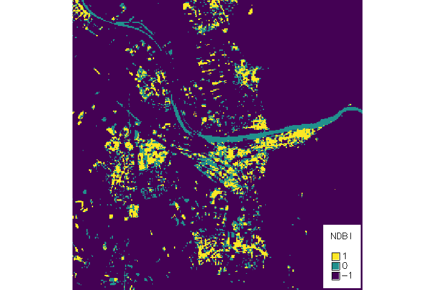
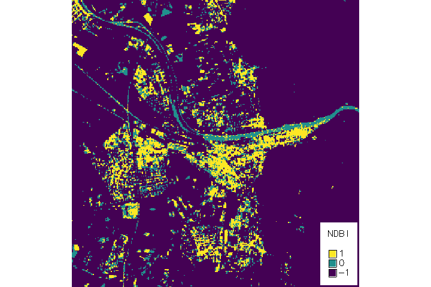

# Multi-Temporal Data Processing for Detection of urban growth

## 1. Introduction
Urbanization is a global phenomenon increasingly shaping the world’s population. In 2020, 56.2% of the global population lived in cities, and this is projected to rise to 68.4% by 2050 (UN-Habitat, 2022). In Europe, the share was already 74.9% in 2020, and it is expected to grow to 83.7% by 2050 (UN-Habitat, 2022). A key outcome of urbanization is urban sprawl. Urban sprawl has significant negative environmental, economic, and social effects (Behnisch et al., 2022). It contributes to an increase in greenhouse gas emissions and threatens the long-term availability of essential ecosystem services (Behnisch et al., 2022). As a result, urban expansion contradicts the core principles of sustainable land management and the urgent need for a shift towards sustainability (Behnisch et al., 2022). Urban sprawl causes irreversible changes to land cover, which can be effectively visualized through remote sensing data, such as satellite imagery (Chettry, 2023, Zha et al., 2003). By combining this data with composite indices, a more accurate analysis of the environmental consequences of urbanization can be achieved (Chettry, 2023). The NDBI (Normalized Difference Built-up Index) is a widely used index for identifying built-up areas in satellite imagery and has been shown to achieve high accuracy, often exceeding 90% when combined with the NDVI (Normalized Difference Vegetation Index), a common index used for mapping vegetation (Karanam, 2018; Zha et al., 2003).
The goal of this work is to develop a script-based automation for calculating the difference between NDBI and NDVI, as proposed by Zha et al. (2003). Additionally, this work aims to investigate the effectiveness of this method in identifying and analyzing urban areas over time, with a particular focus on the city of Heidelberg.

## 2. Method
To conduct the analysis, satellite images from June 9, 2000, and June 25, 2023, covering the city of Heidelberg, were obtained. Landsat 7 and 9 images were downloaded using the USGS Earth Explorer (https://earthexplorer.usgs.gov/). These images consist of multiple spectral bands, each capturing specific wavelengths of reflected light. Since different surfaces reflect light in unique patterns, satellite imagery allows for distinguishing e.g. between urban areas and vegetation-rich regions.
For the analysis, GRASS GIS (version 8.4) was used. First, the NDBI was calculated, with positive values indicating urban areas and negative values representing non-built-up land. Using the Near Infrared (NIR) and Short-Wave Infrared (SWIR) bands, the following formula was applied:

NDBI = ( SWIR - NIR ) / ( SWIR + NIR )

This was followed by the computation of the NDVI, which highlights vegetation through positive values and utilizes the Red and NIR bands.

NDVI = ( NIR - Red ) / ( NIR + Red)

## 3. Results
The results of the analysis are represented in Fig. 1 and Fig. 2 by three distinct values: 1, 0, and -1. A value of 1 indicates urban areas, identifying built-up regions. In contrast, a value of -1 represents non-urban areas, such as vegetation or natural landscapes. A value of 0 signifies land that is neither urban nor vegetated, including the river or other surfaces that do not fall clearly into either category.

*Fig. 1: Results from Heidelberg, 09.06.2000*

The analysis reveals a general increase in both the size and density of urban areas in 2023 compared to the earlier dataset, especially in the districts Altstadt, Bahnstadt and Eppelheim. Additionally, there is a slight increase in areas classified with a value of 0, e.g. in the Pfaffengrund and Neuenheimer Feld. The results of the index are highly dependent on the chosen threshold, which determines when an area is classified as urban or vegetated. This sensitivity is particularly evident in the classification of the Neckar River, which consistently receives a value of 0 in both years. Since the river is neither vegetation nor urban, both NDBI and NDVI yield values close to zero, resulting in a final difference of 0. Consequently, the river stands out clearly in both time periods. Other areas classified with a value of 0 include some agricultural fields, barren land, and even certain settlements. These settlements appear to have reflectance values below the NDBI threshold, preventing their classification as urban, despite their built-up characteristics.
An important factor to consider when interpreting the results is the 30-meter spatial resolution of the data, which limits the level of detail. This simplification affects the representation of many areas, particularly smaller structures or heterogeneous land uses, leading to a more generalized depiction.

*Fig. 2: Results from heidelberg, 25.06.2023*

This effect is particularly noticeable in the Neuenheimer Feld as well as other residential areas, where large gaps appear in the classification despite being built-up areas. These spaces contain just enough vegetation to fall below both the NDBI and NDVI thresholds. As a result, they are classified as "non-vegetation" by the NDVI but also do not meet the NDBI threshold for urban areas, leading to their omission from both categories. 

## 4. Conclusion
The urban area has been effectively identified and highlighted using the chosen NDBI method, especially when compared to the surrounding areas. In 2023, the urban area was even more clearly visible than in 2000, which could be attributed to the improved sensor quality of the satellite images. However, due to the aforementioned inaccuracies, such as generalization caused by the 30m resolution, misclassification of undeveloped fields as urban areas, and image quality, directly comparing the two images and calculating the difference in urban area would not yield reliable results.

## Literature
- [Behnisch M, Krüger T, Jaeger JAG (2022) Rapid rise in urban sprawl: Global hotspots and trends since 1990. PLOS Sustain Transform 1(11): e0000034.](http://dx.doi.org/10.1371/journal.pstr.0000034)
- [Chettry, V (2023) A Critical Review of Urban Sprawl Studies. J geovis spat anal 7, 28 (2023).](https://doi.org/10.1007/s41651-023-00158-w)
- [Karanam,  H.  (2018)  STUDY  OF  NORMALIZED DIFFERENCE  BUILT-UP  (NDBI)  INDEX  IN AUTOMATICALLY  MAPPING  URBAN  AREAS  FROM LANDSAT TM  IMAGERY. International Journal of Scientific Research and Review, 7(1).](https://www.researchgate.net/publication/339230287_STUDY_OF_NORMALIZED_DIFFERENCE_BUILT-UP_NDBI_INDEX_IN_AUTOMATICALLY_MAPPING_URBAN_AREAS_FROM_LANDSAT_TM_IMAGERY)
- [UN-Habitat (2022) World cities report 2022: Envisaging the Future of Cities. United Nations Human Settlements Programme (UN Habitat), Nairobi](https://unhabitat.org/sites/default/files/2022/06/wcr_2022.pdf)
- [Y. Zha, J. Gao & S. Ni (2003) Use of normalized difference built-up index in automatically mapping urban areas from TM imagery, International Journal of Remote Sensing, 24:3, 583-594.](http://dx.doi.org/10.1080/01431160304987)
